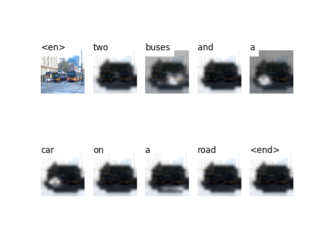

# Cross-lingual Image Captioning (Multilingual image captioning)

# Objective 

The objective of our project is to address the challenge of multilingual image captioning. Traditionally, most systems generate image descriptions in a single language, necessitating separate models for each language. This approach becomes impractical as it requires maintaining and deploying multiple language-specific models. To overcome this limitation, a straightforward technique to develop a unified model capable of generating captions across multiple languages. We evlaute our approach specifically for English, Italian and Spanish caption dataset. To achive this introduce an artificial tokens to control the language, with the aim to create a compact image captioning system that can switch between different languages. Through experimentation, demonstrate that a neural captioning architecture can effectively learn a single encoder-decoder model capable of producing high-quality image descriptions in the desired languages, thereby streamlining the process of multilingual image captioning.

# Implementation 

## Environment Set Up

We use conda to set-up out environment.

```
$ conda create -n multi_IC python=3.7
$ conda activate multi_IC 
$ conda install --file requirements.txt
```

## Dataset

In this project, we utilize MS-COCO_2014 dataset across three languages:

- **English MS-COCO Dataset**: We utilize the origina [MS-COCO dataset](https://cocodataset.org/#download).

- **Italian Dataset**: We employ a translated version of the Ms-COCO dataset in Italian, available at [Italian COCO Dataset](https://github.com/crux82/mscoco-it).

- **Spanish Dataset**: Similarly, we employ a translated version of the MS-COCO dataset in Spanish, accessible from [Spanish COCO Dataset](https://github.com/carlosGarciaHe/MS-COCO-ES).

For English and Italian data, the images can be downloaded from the original [MS-COCO dataset](https://cocodataset.org/#download). Therefore, they share same set of images. 

For captions, we refer to Andrej Karpathy's training, validation, and test splits format, and redesign it to suit multilingual captioning dataset needs. The multilingual data can be found within the 'data' directory. The table below provides a summary of the total number of images and annotations we use in this project. 

|  | English | Italian | Spanish | 
|----------|----------|----------|----------|
| Training Images| 82,783 | 82,080 | 22,000 |
| Training Annotations | 414,113 | 410,596| 110,000 |
| Validation Images | 40,503 | 34,115 | 5,000 |
| Validation Annotations| 202,654 | 170,690 | 1,000 |

## Model Architecture 

- **Encoder** : We use a pre-trained ResNet-101 model provided within PyTorch's torchvision module. The final two layers, namely the pooling and linear layers, are omitted as our primary requirement is to encode the image, not classify it.

- **LSTM decoder** 

- **Tansformer decoder** 

## Training

Before you begin training, ensure that you have saved the necessary data files for training, validation, and testing. To accomplish this, execute the commands contained within [create_input_files.py]() to generate required data files: 

- An HDF5 file containing images, structured as a tensor of dimensions I x 3 x 256 x 256, where I represents the number of images in the split. Pixel values range from 0 to 255 and are stored as unsigned 8-bit integers

- A JSON file for each split containing a list of N_c * I encoded captions. Here, N_c denotes the number of captions sampled per image. These captions are arranged in the same sequence as the images in the HDF5 file

- Another JSON file for each split, comprising a list of N_c * I caption lengths. Each value in the list represents the length of the corresponding caption

- A JSON file containing the word_map, serving as the word-to-index dictionary

Therefore, the inputs to the model are:  images, captions, caption length

[trainer.py]()

In this module, you have the flexibility to examine or adjust the parameters as needed. Whether you prefer to train your model from the beginning or resume training from a checkpoint, specify the checkpoint parameter accordingly. Additionally, validation is automatically conducted at the end of each training epoch.

Thismodule has many parameters, so we see only few of them in detail. In our implementation that are two decoders i.e. LSTM and Transformer, also you can modify the number of layers. You can also adjust the training hyperparameters such as learning rate and batch size. "alpha_c" denotes the weight allocated to the secondary loss, while 'checkpoint' refers to the path of the perviouly saved model. Given that we are generating a sequence of words, we use CrossEntropyLoss for computation. Losses are not calculated over padded regions. To handle this, PyTorch's pack_padded_sequence() function can be employed. This function flattens the tensor by timestep while disregarding padded regions. Additionally, we utilize the Adam optimizer.

For assessing the model's performance on the validation set, employ the automated BiLingual Evaluation Understudy (BLEU) evaluation metric. This metric compares a generated caption with reference caption(s). Notably, the authors of the Show, Attend, and Tell paper[3] highlight that the correlation between loss and BLEU score diminishes beyond a certain threshold. Therefore, they advise to stop training early if the BLEU score starts to drop, even if the loss continues to decrease.

## Inference 

[model_evaluation.py]()

Evaluating the trained model involves generating captions and obtaining scores from automatic evaluation metrics such as BLEU 1-4, METEOR, ROUGE_L, and CIDEr. Notably, there are two distinctions between the training and evaluation procedures. During evaluation, beam search is employed to generate captions, and the previous output of the model serves as the input at the subsequent timestep.

[inference.py]()

Process an test image and generate a caption using beam search. After hyperparameter tuning the beam size of 3 works best. The output of this module includes the generated caption along with the visualization of attention.


## Experimental Results

Below are the results obtained from the test set for both architectures: CNN-LSTM and CNN-Transformer. Each model was trained for 50 epochs with a batch size of 256. Utilizing A100 GPUs, the CNN-LSTM model required 4 days for training, while the CNN-Transformer model was trained over 3 days.

 Evaluation metrics including BLEU, Rouge, and CIDEr scores were computed using a beam size of 3.

| Model:CNN-LSTM | BLEU-1 | BLEU-2 | BLEU-3 | BLEU-4 | Rouge-L | 
|----------|----------|----------|----------|----------|----------|
| English | 43.61 | 34.69 | 28.01 | 23.78 | 34.63 |
| Italian | 42.19 | 34.81 | 28.72 | 23.68 | 33.62 |
| Spanish | 19.27 | 11.75 | 8.16 | 6.10 | 16.32 | 


| Model:CNN-Transformer | BLEU-1 | BLEU-2 | BLEU-3 | BLEU-4 | Rouge-L |
|----------|----------|----------|----------|----------|----------|
| English | 44.46 | 36.49 | 30.35 | 25.69 | 36.17 | 
| Italian | 43.36 | 36.58 | 30.25 | 25.18 | 35.60 |
| Spanish | 19.06 | 12.79 | 8.36 | 6.36 | 16.42 |


## Some examples

[1] Saliency map illustrating the inference of a CNN encoder-LSTM decoder model on English language


[2] Saliency map illustrating the inference of a CNN encoder-LSTM decoder model on Italian language


[3] Saliency map illustrating the inference of a CNN encoder-LSTM decoder model on Spanish language


[4] Saliency map illustrating the inference of a CNN encoder-Transformer decoder model on English language


[5] Saliency map illustrating the inference of a CNN encoder-Transformer decoder model on Italian language


[6] Saliency map illustrating the inference of a CNN encoder-Transformer decoder model on Spanish language


# References

[1] Vaswani, Ashish, et al. "Attention is all you need." Advances in neural information processing systems. 2017

[2] Tsutsui, et.al "Using Artificial Tokens to Control Languages for Multilingual Image Caption Generation" CVPR Language and Vision Workshop. 2017

[3] Xu, Kelvin, et al. "Show, attend and tell: Neural image caption generation with visual attention." International conference on machine learning. 2015.

[4] [Pytorch: ResNet](https://pytorch.org/vision/main/models/resnet.html) 

[5] He, Kaiming, et al. "Deep residual learning for image recognition." Proceedings of the IEEE conference on computer vision and pattern recognition. 2016.

[6] Anderson, Peter, et al. "Bottom-up and top-down attention for image captioning and visual question answering." Proceedings of the IEEE conference on computer vision and pattern recognition. 2018.

[7] [https://github.com/sgrvinod/a-PyTorch-Tutorial-to-Image-Captioning#implementation](https://github.com/sgrvinod/a-PyTorch-Tutorial-to-Image-Captioning#implementation)

[8] [https://github.com/RoyalSkye/Image-Caption](https://github.com/RoyalSkye/Image-Caption)
